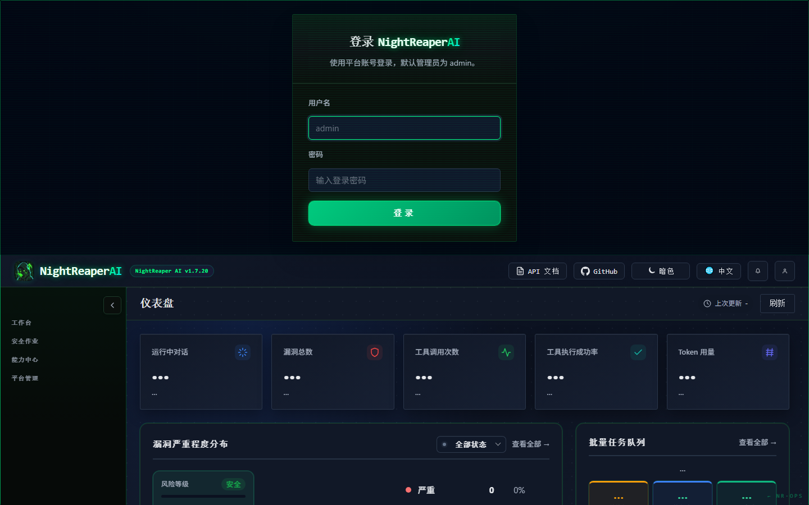
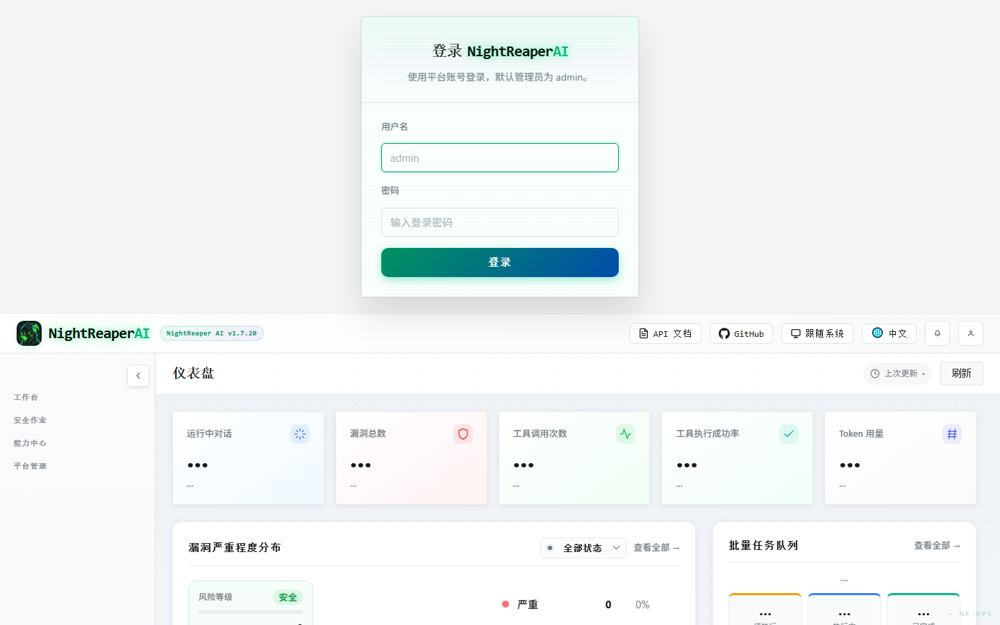

# ⚰️ NightReaper AI（夜镰）

> **AI 驱动的自主渗透测试作战平台**
> 侦察 · 漏洞利用 · 内网横向 · C2 · 战报 —— 一个浏览器标签页全部搞定
>
> **by yyyr（亦悠悠然）· 女娲安全工作室**

```
 ██╗░░░██╗██╗░░██╗██████╗░  NightReaper AI v1.7.20
 ██║░░░██║██║░██╔╝██╔══██╗  reaping the dark
 ██║░░░██║█████╔╝░██████╔╝  operator: yyyr
 ██║░░░██║██╔═██╗░██╔═══╝░  studio: 女娲安全工作室
 ╚██████╔╝██║░░██╗██║░░░░░  license: Apache-2.0
 ░╚═════╝░╚═╝░░╚═╝╚═╝░░░░░  github.com/daimabiabia
```

---

## 这是什么

NightReaper AI 是一个**源码级深度定制**的 AI 渗透测试平台：给它一个目标，它会自主规划攻击路径、调用 100+ 安全工具（nmap / sqlmap / nuclei / subformer / ffuf …）、执行多阶段攻击链、并把结果沉淀成资产库、漏洞库与攻击链图谱。

底层引擎基于开源项目 [CyberStrikeAI](https://github.com/Ed1s0nZ/CyberStrikeAI) v1.7.20（Apache License 2.0）构建——**感谢原作者 Ed1s0nZ 的杰出工作**。NightReaper 在其之上完成了品牌、视觉、中文化、角色矩阵、并发治理等全方位独立改造，见 [CHANGELOG.md](CHANGELOG.md)。

## ✨ 特性

- 🤖 **多智能体编排**：单代理 / Deep / Plan-Execute / Supervisor 四种模式，16 个专业作战 agent
- 💀 **19 个火力全开攻击角色**：从侦察到「全面击破」一键连招（侦察→nday→爆破→getshell→提权→横向→战报）
- 🛠️ **100+ 工具配方**：主流安全工具即插即用，装了自动启用
- 🧠 **DeepSeek 双通道**：high effort 推理 + low effort 侦察，token 成本减半
- 🚦 **全局并发闸**：模型调用统一排队（默认 4 路），根除 API 限流风暴
- 🛰️ **MCP 扩展**：反向 Shell C2、自定义 MCP 服务热挂载
- 🗺️ **攻击链图谱**：跨会话事实关联、分步回放
- 📊 **作战台**：资产管理、漏洞库、批量任务队列、WebShell 管理、C2 监听
- 🇨🇳 **原生中文界面** + 黑客风开机动画 + 荧光绿终端美学

## 📸 界面预览

**终端作战面板主题**（CRT 扫描线登录 + 作战网格背景 + 荧光绿描边体系）：





> 亮 / 暗双主题随系统切换，支持 `?theme=dark` 直达链接。

## 📦 部署

### 方式一：源码编译（推荐）

```bash
git clone https://github.com/daimabiabia/NightReaperAI.git
cd NightReaperAI
export GOPROXY=https://goproxy.cn,direct
go build -ldflags="-s -w" -o nightreaper-ai.exe ./cmd/server
```

> 纯 Go SQLite 驱动（modernc.org/sqlite），**无需安装 gcc**，Windows / Linux / macOS 直接编。

### 方式二：Release 二进制

到 [Releases](https://github.com/daimabiabia/NightReaperAI/releases) 下载对应平台压缩包，解压即用。

## 🚀 快速开始

1. 编辑 `config.yaml`，填入你的 DeepSeek API Key（同时支持任何 OpenAI 兼容接口）
2. 启动服务：`./nightreaper-ai.exe`（默认 `http://127.0.0.1:8080`）
3. 默认账号 `admin`，**首次登录立即改密码**
4. 创建项目 → 添加目标资产 → 选个角色开打

```yaml
# config.yaml 核心段
ai:
  default_channel: deepseek-main
  channels:
    deepseek-main:
      api_key: "sk-xxxx"        # high effort：漏洞推理 / PoC / 报告
    deepseek-fast:
      api_key: "sk-xxxx"        # low effort：侦察 / 枚举，省钱档
```

## ⚠️ 免责声明

本项目仅供**已获得书面授权**的安全测试、教学与研究使用。请在合法合规前提下使用，使用者对自身行为承担全部责任，作者不承担任何滥用导致的法律责任。未经授权对第三方系统进行测试属于违法行为。

## 📄 许可证

- 本项目遵循 **Apache License 2.0**（见 [LICENSE](LICENSE)）
- 底层引擎源自 [CyberStrikeAI](https://github.com/Ed1s0nZ/CyberStrikeAI) © Ed1s0nZ，依 Apache 2.0 许可使用并已作大幅修改
- NightReaper 品牌、视觉设计、角色矩阵与全部定制层 © 2026 yyyr · 女娲安全工作室

---

*reaping the dark — 夜镰所至，寸草不生。*
